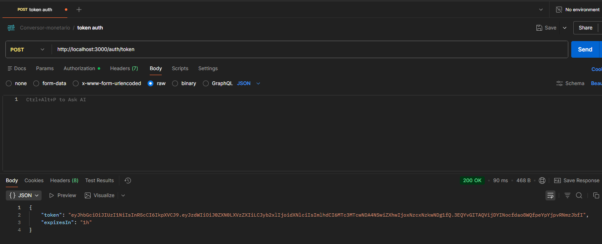
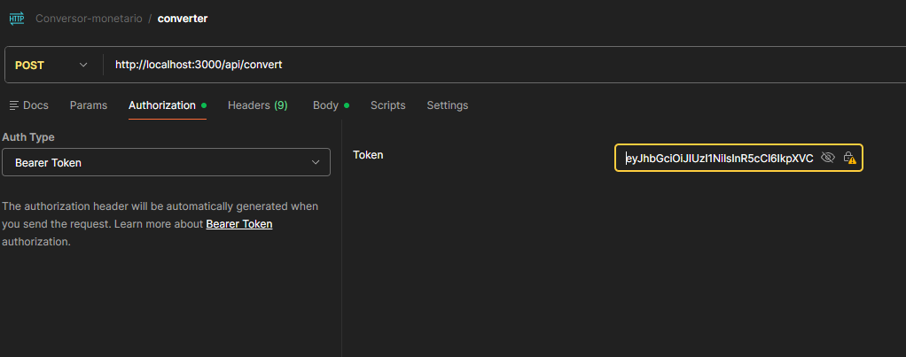
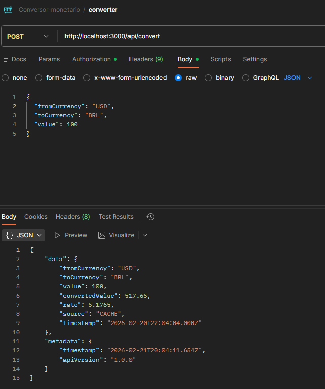

# Conversor Monetário

API REST em Node.js para conversão de moedas em tempo real, com autenticação, cache e validação de dados.

---

## Features

- Conversão de moedas via cotação em tempo real (AwesomeAPI);
- Autenticação por API Key e JWT;
- Cache com TTL de 2 minutos para evitar requisições desnecessárias à API externa;
- Validação de entrada com Zod;
- Tratamento de erros;
- Testes unitários e de integração;
- Logging estruturado em JSON com Pino;
- Segurança com Helmet e rate limit;

---

## Instalação

```bash
# 1.Instalar dependências
npm install

# 2.Configurar env
cp .env.example .env

# 3.Iniciar o servidor
npm start
```

---

## Autenticação

A API suporta dois métodos de autenticação:

**API Key** — informe sua chave no header `Authorization`:

```
Authorization: Bearer seu_api_key
```

**JWT** — gere um token e utilize da mesma forma:

```bash
TOKEN=$(curl -s -X POST http://localhost:3000/auth/token | jq -r '.token')
```

---

## Endpoints

### `POST /api/convert`

Converte um valor de uma moeda para outra.

**Headers**

| Header          | Valor                        |
|-----------------|------------------------------|
| Content-Type    | application/json             |
| Authorization   | Bearer `<token_ou_api_key>`  |

**Body**

```json
{
  "fromCurrency": "USD",
  "toCurrency": "BRL",
  "value": 100
}
```

**Resposta**

```json
{
  "data": {
    "fromCurrency": "USD",
    "toCurrency": "BRL",
    "value": 100,
    "convertedValue": 550.00,
    "rate": 5.5,
    "source": "AwesomeAPI",
    "timestamp": "2024-02-20T10:30:45.123Z"
  },
  "metadata": {
    "timestamp": "2024-02-20T10:30:45.123Z",
    "apiVersion": "1.0.0"
  }
}
```

O campo `source` indica se o dado veio da API (`"AwesomeAPI"`) ou do cache (`"cache"`).

---

## Exemplos com cURL

**API Key**

```bash
curl -X POST http://localhost:3000/api/convert \
  -H "Content-Type: application/json" \
  -H "Authorization: Bearer seu_api_key" \
  -d '{
    "fromCurrency": "USD",
    "toCurrency": "BRL",
    "value": 100
  }'
```

**JWT**

```bash
#Gerar token
TOKEN=$(curl -s -X POST http://localhost:3000/auth/token | jq -r '.token')

#Realizar conversão
curl -X POST http://localhost:3000/api/convert \
  -H "Content-Type: application/json" \
  -H "Authorization: Bearer $TOKEN" \
  -d '{
    "fromCurrency": "USD",
    "toCurrency": "BRL",
    "value": 100
  }'
```

## Exemplos com postman

**Gerando token no postman**





**Colocando token no bearer**





**Realizar conversão**





---

## Testes

```bash
#Todos os testes
npm test

#Apenas unitário
npm run test:unit

#Apenas integração
npm run test:integration

#Com relatório de cobertura
npm test -- --coverage
```

---

## Lint e Formatação

```bash
npm run lint
npm run lint:fix
npm run format
```

---

## Arquitetura

```
src/
├── controllers/     # Recebe os requests e delega para o domínio;
├── routes/          # Definição das rotas e middlewares;
├── domain/          # Lógica de negócio e validação;
├── data/            # Cache e integração com API;
└── utils/           # Logger e tratamento de erros;
```